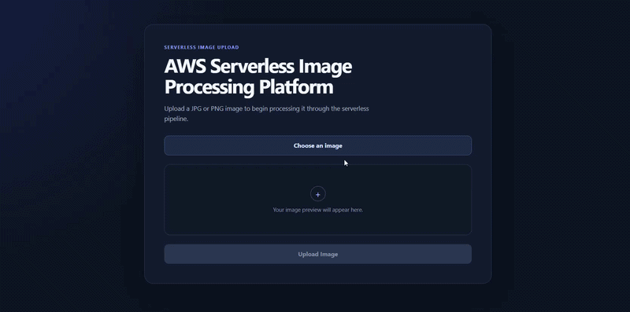

# Serverless Image Processing Platform

A serverless image-processing application built with AWS Lambda, S3, SQS, API Gateway, React, Pillow, and Terraform.

The application accepts JPEG and PNG uploads, stores them privately in S3, processes them asynchronously, and returns multiple optimized image variants to the frontend.

## Demo



## Architecture

### Upload and processing flow

```text
+----------------------+
|    React / Vite      |
|      Frontend        |
+----------+-----------+
           |
           | Request upload authorization
           v
+----------------------+
| API Gateway HTTP API |
+----------+-----------+
           |
           v
+----------------------+
|   Presign Lambda     |
+----------+-----------+
           |
           | Presigned POST
           v
+----------------------+
|   Private S3 Bucket  |
|      incoming/       |
+----------+-----------+
           |
           | ObjectCreated event
           v
+----------------------+
| Standard SQS Queue   |
+----------+-----------+
           |
           v
+----------------------+
| Processing Lambda    |
|      + Pillow        |
+----------+-----------+
           |
           v
+----------------------+
|   Private S3 Bucket  |
|     processed/       |
+----------------------+
```

Image bytes upload directly from the browser to S3 rather than passing through API Gateway or Lambda.

Processing is asynchronous: S3 emits an object-created event, SQS buffers the work, and the processor Lambda handles image transformation independently of the upload request.

### Status and result flow

```text
React frontend
      |
      | Poll processing status
      v
API Gateway
      |
      v
Status Lambda
      |
      v
Processed S3 objects
      |
      v
Short-lived presigned GET URLs
      |
      v
Frontend displays processed images
```

## Processing outputs

Uploads are limited to JPEG/JPG and PNG files up to 25 MiB.

Each upload receives a server-generated UUID. Original filenames are not used as processing keys or local processing paths.

A successfully processed image produces:

```text
processed/<uuid>/thumbnail.jpg
processed/<uuid>/medium.jpg
processed/<uuid>/optimized.webp
```

The frontend polls for processing status and displays the generated results when they become available.

## Engineering highlights

- Direct browser-to-S3 uploads using short-lived presigned POST policies
- Private S3 storage with Block Public Access
- Asynchronous image processing through SQS
- Retry handling with a dead-letter queue
- Deterministic output paths for safe repeated processing
- Pillow-based image-content validation
- JPEG and PNG verification with decompression-bomb protections
- EXIF orientation handling
- Server-generated UUID object keys
- Least-privilege Lambda execution roles
- Lambda execution-role permissions boundary
- Dedicated restricted Terraform deployment role
- Infrastructure managed with Terraform
- Automated GitHub Actions validation without AWS credentials

## Security

The S3 bucket is private and configured with:

- S3 Block Public Access
- `BucketOwnerEnforced` ownership
- SSE-S3 AES256 encryption
- TLS-only bucket access
- lifecycle expiration for development image objects

Presigned upload policies:

- expire after five minutes
- restrict upload size
- restrict `Content-Type`
- enforce the generated object key
- require AES256 server-side encryption

IAM permissions are scoped by responsibility:

- The presign Lambda can write only to `incoming/*`
- The processor Lambda can read from `incoming/*`
- The processor Lambda can write only to `processed/*`
- The processor Lambda consumes only the processing SQS queue
- The status Lambda accesses the processed objects required to report status and generate result URLs

The Lambda execution roles are additionally constrained by a customer-managed permissions boundary.

Routine Terraform operations use the dedicated:

```text
serverless-image-terraform-deploy
```

deployment role.

Bootstrap and recovery privileges are kept separate from normal Terraform deployment permissions.

No long-lived IAM access keys are used.

Reference IAM policy examples are available in [`docs/iam/`](docs/iam/):

- [Terraform deployment role permissions](docs/iam/terraform-deployment-role-permissions-policy.example.json)
- [Terraform deployment role trust policy](docs/iam/terraform-deployment-role-trust-policy.example.json)
- [Lambda runtime permissions boundary](docs/iam/lambda-runtime-permissions-boundary.example.json)

These files document the reviewed IAM design and are not automatically applied by Terraform.

## Image validation

Uploaded image content is validated with Pillow instead of trusting file extensions or MIME metadata alone.

Validation includes:

- JPEG and PNG content verification
- `Image.verify()` followed by reopening the image for processing
- truncated-image rejection
- Pillow decompression-bomb protection
- maximum dimension of 10,000 pixels
- maximum total pixel count of 25,000,000
- EXIF orientation handling
- generated temporary paths under `/tmp`
- no use of original filenames as temporary processing paths

## Queue and failure handling

The processing pipeline uses:

- SQS standard queue
- batch size of 1
- maximum event-source concurrency of 2
- 360-second visibility timeout
- four-day main queue retention
- dead-letter queue after three receives
- 14-day DLQ retention
- SQS-managed encryption

Malformed or transient processing failures retry through SQS and eventually move to the DLQ.

Deterministic output paths make duplicate message delivery safe because repeated processing targets the same UUID-based result locations.

S3 notifications are filtered to `incoming/`, so generated objects under `processed/` cannot recursively trigger the processor.

S3 `s3:TestEvent` messages are handled as harmless successful no-ops.

## Infrastructure

The AWS infrastructure is managed with Terraform.

The configuration includes:

- S3 storage and lifecycle rules
- API Gateway HTTP API
- Lambda functions
- SQS processing queue and DLQ
- S3 event notifications
- Lambda event-source mapping
- IAM roles and scoped inline policies
- CloudWatch log groups
- AWS Budget configuration

Terraform provider versions are constrained and recorded in the committed dependency lock file.

Routine Terraform operations use the restricted deployment role rather than direct administrator access.

## Processor packaging

Before a Terraform plan or apply involving processor Lambda code, build the processor package:

```powershell
.\scripts\build_processor_lambda.ps1
```

The script creates:

```text
.phase4-build/processor-package
```

This generated directory is intentionally ignored by Git.

The packaging process installs Linux/x86_64-compatible Pillow dependencies for the Python 3.12 Lambda runtime instead of copying packages from the local Windows Python environment.

## Testing and CI

Current automated coverage:

- 41 Lambda tests
- 4 processor tests
- 45 Python tests total
- frontend production build validation
- Terraform formatting validation
- Terraform configuration validation

GitHub Actions runs three CI jobs:

```text
Python tests
Frontend build
Terraform validation
```

The Terraform CI job runs:

```text
terraform fmt -check -diff
terraform init -backend=false -lockfile=readonly
terraform validate
```

CI does not use AWS credentials and does not run:

```text
terraform plan
terraform apply
terraform destroy
```

The deployed development environment has also been verified end to end with a real JPEG upload producing:

```text
thumbnail.jpg
medium.jpg
optimized.webp
```

A restricted-role Terraform plan was also verified against the deployed environment and reported no infrastructure changes at the time of testing.

## Design decisions

### Direct browser-to-S3 upload

Image bytes bypass API Gateway and Lambda.

The API is responsible for generating constrained upload authorization and serving status/result requests, while S3 handles the image transfer itself.

### Asynchronous processing with SQS

SQS separates upload completion from image processing and provides retry and dead-letter behavior between S3 and the processing Lambda.

This keeps image processing independent of the frontend request lifecycle.

### Deterministic output paths

Processed objects use UUID-based deterministic locations.

This makes repeated delivery of the same queue message safe because the processor writes to the same known output paths.

### Scoped infrastructure

The architecture uses only the services required for the current workload.

It does not currently require:

- DynamoDB
- EventBridge
- Step Functions
- VPC networking
- NAT Gateway
- Cognito
- ECR
- customer-managed KMS keys

## Current limitations

This repository represents a development and portfolio deployment rather than a production service.

Current limitations include:

- upload and status endpoints are unauthenticated
- CORS is configured for local Vite development origins
- Terraform state is stored locally
- frontend hosting is not automated
- CI validates the repository but does not deploy infrastructure
- privileged IAM bootstrap/recovery access remains separate from the restricted routine Terraform role

A production deployment would require additional work around authentication, hosted frontend delivery, Terraform state management, deployment automation, and operational controls.
